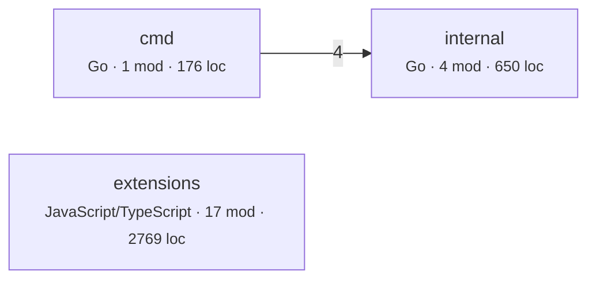
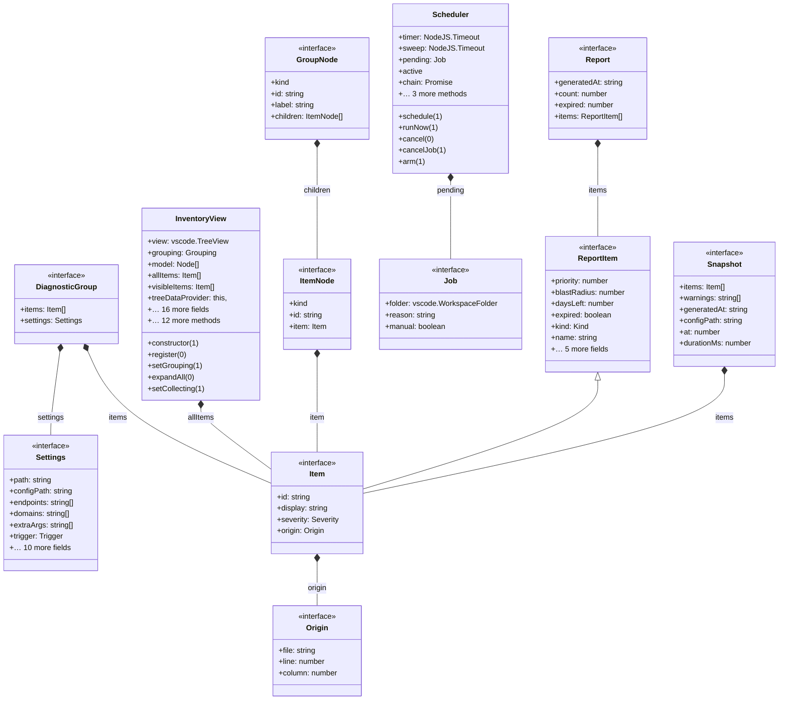
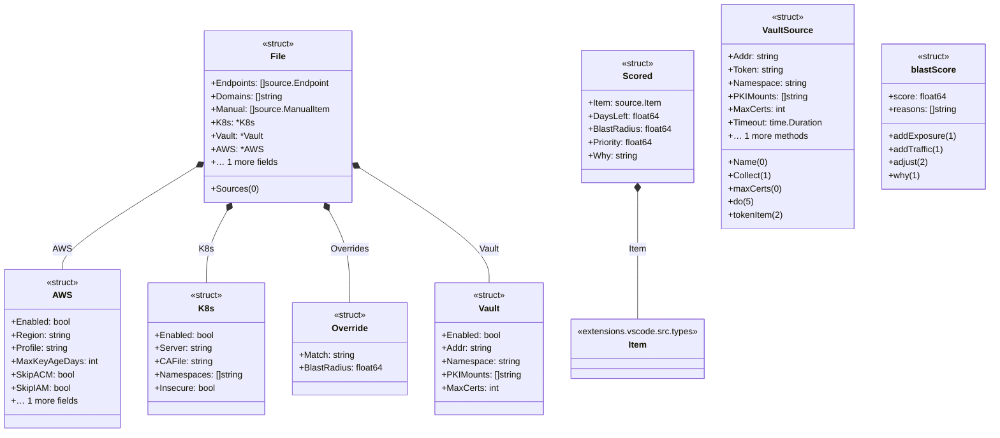

# Architecture map

Derived from source by automap 2.0. Every line is computed, not written. Regenerate with `automap map`; do not edit by hand.

## What this says about the system

Each item fired because a measurement crossed a threshold. The numbers and the evidence are from your code; the explanation is fixed text from a rule catalog, identical every time that rule fires on any repository. `automap rules` prints the catalog on its own so you can audit the claims before trusting them here. What none of it can tell you is why your team built it this way — that is what `automap adr` leaves blank.

| | count |
|---|---:|
| Worth attention | 1 |
| Minor | 3 |
| Notes | 1 |

### Worth attention · 1 module(s) are more than 4× the median size (128 lines); the largest is 677 lines.

**Why it matters.** A file this far from the median is rarely one idea. It cannot be reviewed in one sitting, it produces merge conflicts between people working on unrelated things, and it hides its internal structure from every tool that works at file granularity — including this one, which sees it as a single node.

**What usually causes it.** Accretion. Each addition was small and reasonable, and no single commit was the one that made it too large.

**What to do.** Split along the lines its own imports suggest: the groups of functions that share dependencies are usually the natural modules. Do it before it becomes the file everyone avoids.

<details><summary>Evidence</summary>

- `extensions/vscode/src/extension.ts` — 677 lines

</details>

<sub>`ARCH-GODFILE` · Size and shape</sub>

### Minor · 1 component(s) sit far from the balance between how abstract they are and how much depends on them.

**Why it matters.** Two bad corners exist. A component that is concrete and widely depended on is rigid: it cannot change without breaking its dependents, and it offers no seam to extend through. A component that is abstract and depended on by nothing is unused indirection: interfaces with one implementation and no callers.

**What usually causes it.** Rigidity comes from exposing concrete types across a boundary instead of an interface. Unused abstraction comes from designing for a second implementation that never arrived.

**What to do.** For the rigid ones, introduce an interface on the depended-on side and let dependents bind to that. For the unused abstractions, collapse the indirection until a second implementation actually exists.

<details><summary>Evidence</summary>

- `extensions` — abstractness 0.27, instability 0.0, distance 0.73

</details>

<sub>`ARCH-MAINSEQ` · Structure</sub>

### Minor · 1 component(s) are named for what they contain rather than what they do: `internal`.

**Why it matters.** A name like `utils` or `common` states no membership rule, so no code can ever be argued out of it. These components grow monotonically, acquire dependents from everywhere, and reliably turn into the hubs and cycles reported elsewhere in this document. The naming is not the problem; it is the earliest visible symptom.

**What usually causes it.** A file needed in two places, no obvious home, and a directory that accepts anything.

**What to do.** Split by what the code is for, not by what it is. If a rule for what belongs cannot be written in one sentence, the component is not one component.

<details><summary>Evidence</summary>

- `internal` — 4 modules, 650 lines, 1 dependents

</details>

<sub>`ARCH-VAGUE` · Boundaries</sub>

### Minor · 3 modules over 30 lines are imported by nothing in this tree.

**Why it matters.** Unreferenced code still gets read, still gets updated during refactors, and still appears in searches. If it is genuinely unused it is a tax on every future reader. If it is used through a mechanism no static tool can see, that mechanism is exactly the thing worth writing down, because nobody will infer it.

**What usually causes it.** Entry points invoked by a runner or framework, plugins loaded by name, code kept 'just in case', or genuine leftovers.

**What to do.** Check each against how it is actually invoked. Delete what is dead; for the rest, record the invocation mechanism where a reader will find it.

<details><summary>Evidence</summary>

- `cmd/expiry-radar/main.go` — 176 lines
- `extensions/vscode/esbuild.mjs` — 47 lines
- `extensions/vscode/src/extension.ts` — 677 lines

</details>

<sub>`ARCH-ORPHAN` · Size and shape</sub>

### Note · No layering declared, so layer checks are off.

**Why it matters.** Cycles and coupling are measurable without knowing your intent, but 'this dependency should not exist' is not. Declaring layers is how you tell the tool what the design is supposed to be, which turns a description into a check that can fail in CI.

**What usually causes it.** Most repositories never write the layering down; it lives in review comments and in whoever has been there longest.

**What to do.** Add a `layers` map to `.automap.json`, ordered top to bottom. Start with the layering you believe you have — the first run will tell you whether you have it.

<sub>`ARCH-NOLAYERS` · Evidence quality</sub>

## Inside the files

The section above reasons about the import graph, where an edge either exists or does not. This one reads inside files, and its evidence is weaker by construction. Python is analysed with its real grammar, so complexity, nesting, length and parameter counts are exact. Every other language is matched lexically against comment-stripped source: those rules report **the presence of a construct, not a proven defect**. There is no dataflow analysis here. A flagged line may be perfectly correct in context, and an unflagged file may still be wrong. Read these as places to look, not as a verdict.

| category | findings |
|---|---:|
| Security | 2 |
| Performance | 1 |
| Algorithms and data structures | 1 |
| Maintainability | 1 |

### Security

**Serious · SEC-EVAL** — 17 occurrence(s) across 4 file(s).

*Why it matters.* Evaluating a string as code means the set of things this program can do is not fixed at build time. If any part of that string is influenced by input, the answer is 'anything the process can do'. It also defeats every other tool in the pipeline: type checkers, linters, and this one cannot see through it.

*What usually causes it.* Usually dynamic dispatch, config-driven behaviour, or deserialising something convenient. Almost always reachable another way.

*What to do.* Replace with an explicit dispatch table mapping allowed names to functions. If the input really is arbitrary code, isolate it in a sandboxed process with its own privileges.

<details><summary>Evidence</summary>

- `extensions/vscode/src/edit.ts:61` — `exec(`
- `extensions/vscode/src/edit.ts:61` — `exec(`
- `extensions/vscode/src/edit.ts:89` — `exec(`
- `extensions/vscode/src/edit.ts:219` — `exec(`
- `extensions/vscode/src/edit.ts:223` — `exec(`
- `extensions/vscode/src/edit.ts:225` — `exec(`

</details>

**Serious · SEC-SHELL** — 117 occurrence(s) across 13 file(s).

*Why it matters.* Handing a string to a shell means the shell parses it: quoting, globbing, pipes, and semicolons all apply. Any input that reaches that string can add another command. This is command injection, and it is one of the oldest and most reliably exploited defects there is.

*What usually causes it.* Building a command line by concatenation because it is the shortest way to call an external tool.

*What to do.* Pass an argument list rather than a string, and do not involve a shell: `subprocess.run([...], shell=False)`, `execFile`, `ProcessBuilder`. If a shell feature is genuinely needed, validate against an allowlist first.

<details><summary>Evidence</summary>

- `extensions/vscode/esbuild.mjs:18` — ``src/test/${`
- `extensions/vscode/scripts/copy-package-files.mjs:16` — ``copied ${`
- `extensions/vscode/src/diagnostics.ts:28` — ``${item.display} expired ${`
- `extensions/vscode/src/diagnostics.ts:29` — ``${item.display} expires in ${`
- `extensions/vscode/src/diagnostics.ts:30` — ``${head}.\n\n${item.why}\n\n${`
- `extensions/vscode/src/doctor.ts:36` — ``${MARK[level]} ${`

</details>

### Performance

**Worth attention · PERF-SYNCIO** — 4 occurrence(s) across 4 file(s).

*Why it matters.* Synchronous I/O blocks the event loop, which in a single-threaded runtime means every other request waits, not just this one. Throughput collapses under concurrency even though each individual operation looks fast.

*What usually causes it.* Startup and CLI code where blocking is fine, later reused inside a request path where it is not.

*What to do.* Use the promise-based forms and await them. Where the call really is startup-only, keep it out of any module that a request path imports so it cannot be reused by accident.

<details><summary>Evidence</summary>

- `extensions/vscode/esbuild.mjs:16` — `readdirSync(`
- `extensions/vscode/scripts/copy-package-files.mjs:15` — `copyFileSync(`
- `extensions/vscode/src/extension.ts:539` — `existsSync(`
- `extensions/vscode/src/runner.ts:73` — `statSync(`

</details>

### Algorithms and data structures

**Worth attention · ALGO-LINEARSCAN** — 10 occurrence(s) across 6 file(s).

*Why it matters.* Membership testing against a list or array is a linear scan. Inside a loop that makes the whole operation quadratic, which is the most common accidental O(n²) in ordinary application code: no algorithm was chosen, a data structure was.

*What usually causes it.* A list was the obvious container when the code was written, and membership testing was added later without revisiting the choice.

*What to do.* Build a set or dictionary once before the loop and test against that. Membership goes from linear to constant, and the change is usually one line.

<details><summary>Evidence</summary>

- `extensions/vscode/esbuild.mjs:7` — `.includes(`
- `extensions/vscode/esbuild.mjs:8` — `.includes(`
- `extensions/vscode/esbuild.mjs:12` — `.includes(`
- `extensions/vscode/src/doctor.ts:58` — `.includes(`
- `extensions/vscode/src/doctor.ts:94` — `.includes(`
- `extensions/vscode/src/doctor.ts:94` — `.includes(`

</details>

### Maintainability

**Worth attention · MNT-SWALLOW** — 2 occurrence(s) across 2 file(s).

*Why it matters.* An empty handler converts a failure into a silent wrong answer. The program continues in a state its author did not anticipate, and the eventual symptom appears somewhere unrelated with no trace of the original cause. Debugging time for these is measured in days.

*What usually causes it.* A failure that was noisy and not understood, silenced to get on with the work, and never revisited.

*What to do.* Handle it, or log it with enough context to identify the case, or let it propagate. If it is genuinely expected and safe, catch the specific exception type and write a comment saying why nothing needs to happen.

<details><summary>Evidence</summary>

- `extensions/vscode/src/extension.ts:445` — `catch {`
- `extensions/vscode/src/runner.ts:260` — `catch {                                    }`

</details>

---

The rest of this document is the evidence those findings were computed from.

## Coverage

What was read, and where every import went. Third-party means the target is expected to live outside this tree. Unaccounted means an import that looks local and resolved to nothing: those are edges missing from the graph below, usually a source root or path alias this tool has not been told about.

| Language | Fidelity | Files | Imports | Internal | Third-party | Unaccounted |
|---|---|---:|---:|---:|---:|---:|
| Go | structural | 16 | 116 | 14 | 102 | 0 |
| JavaScript | structural | 2 | 5 | 1 | 4 | 0 |
| TypeScript | structural | 15 | 55 | 35 | 20 | 0 |

## Shape

- 22 modules across 3 components
- 49 internal import edges, 1 component couplings
- 3595 lines
- propagation cost 17% — the share of other components an average component can reach through import paths
- Go module `github.com/fabiocicerchia/expiry-radar`

## Component graph



Dashed edges came from heuristic scanners. Thick borders are in a cycle. Labels count import sites.

## Ways in, and where they lead

This is not a record of what users do. That lives in analytics, and no static tool can recover it: a route nobody has ever called looks exactly like the one every session hits. What follows is the set of journeys the code **permits** — every way in, every navigation edge between screens, and what each way in can reach.

| Kind | Count | Frameworks |
|---|---:|---|
| Event and queue handlers | 5 | queue consumer |

### What each way in reaches

Components a route can touch by following imports, to a depth of four. This is the blast radius of that endpoint, and the set of code a change to it can disturb.

| Entry | Handler | Components reached |
|---|---|---:|
| `ADDEVENTLISTENER click` | `extensions/vscode/src/report.ts:20` | 0  |
| `ON close` | `extensions/vscode/src/runner.ts:301` | 0  |
| `ON data` | `extensions/vscode/src/runner.ts:290` | 0  |
| `ON error` | `extensions/vscode/src/runner.ts:296` | 0  |
| `ON exit` | `extensions/vscode/src/runner.ts:300` | 0  |

## The nouns

29 types declared: 1 inheritance and 15 composition relationships between types defined in this tree. Relationships to types declared elsewhere are omitted rather than guessed, so this is a lower bound. 0 types were read with a real parser; the rest come from declaration syntax, which is reliable for the declaration and weaker for the member lists.

### `extensions`



### `internal`



**Declared but never implemented in this tree:** `ConfigShape`, `DiagnosticGroup`, `GroupNode`, `Item`, `ItemNode`, `Job`, `ManualEntry`, `Origin`. Either the implementations live outside this tree, or the abstraction has no second case yet and the indirection is not paying for itself.

## Dependency matrix

Row depends on column; the number is how many import sites hold it. Components are ordered leaves first, so an ordinary dependency points to an earlier column and lands below the diagonal. **Every bold cell above the diagonal is a dependency pointing backwards.** Those cells are the whole review: scan the upper triangle and stop. A matrix is used rather than a drawing because it stays readable at any size.

| # | component | 1 | 2 | 3 |
|---|---|---|---|---|
| 1 | `internal` | — | · | · |
| 2 | `extensions` | · | — | · |
| 3 | `cmd` | 4 | · | — |

0 cells above the diagonal.

## Reachability from entry points

What each root actually pulls in, to a depth of three. Nothing imports these modules, so they are where a reader has to start.

**extensions/vscode/src/extension.ts**

```
extensions.vscode.src.extension  (TypeScript)
├─ extensions.vscode.src.config  (TypeScript)
├─ extensions.vscode.src.diagnostics  (TypeScript)
│  ├─ extensions.vscode.src.config  (TypeScript)
│  ├─ extensions.vscode.src.parse  (TypeScript)
│  │  └─ extensions.vscode.src.types  (TypeScript)
│  └─ extensions.vscode.src.types  (TypeScript)
├─ extensions.vscode.src.doctor  (TypeScript)
│  ├─ extensions.vscode.src.config  (TypeScript)
│  ├─ extensions.vscode.src.log  (TypeScript)
│  └─ extensions.vscode.src.runner  (TypeScript)
│     ├─ extensions.vscode.src.config  (TypeScript)
│     ├─ extensions.vscode.src.log  (TypeScript)
│     ├─ extensions.vscode.src.parse  (TypeScript)  ↑ shown above
│     └─ extensions.vscode.src.types  (TypeScript)
├─ extensions.vscode.src.edit  (TypeScript)
│  ├─ extensions.vscode.src.locate  (TypeScript)
│  │  └─ extensions.vscode.src.types  (TypeScript)
│  └─ extensions.vscode.src.types  (TypeScript)
├─ extensions.vscode.src.inventoryView  (TypeScript)
│  ├─ extensions.vscode.src.parse  (TypeScript)  ↑ shown above
│  ├─ extensions.vscode.src.store  (TypeScript)
│  │  └─ extensions.vscode.src.types  (TypeScript)
│  └─ extensions.vscode.src.types  (TypeScript)
├─ extensions.vscode.src.locate  (TypeScript)  ↑ shown above
├─ extensions.vscode.src.log  (TypeScript)
└─ extensions.vscode.src.parse  (TypeScript)  ↑ shown above
└─ … 6 more
```

**cmd/expiry-radar/main.go**

```
cmd.expiry-radar  (Go)
├─ internal.config  (Go)
│  ├─ internal.rank  (Go)
│  │  └─ internal.source  (Go)
│  └─ internal.source  (Go)
├─ internal.output  (Go)
│  ├─ internal.rank  (Go)  ↑ shown above
│  └─ internal.source  (Go)
├─ internal.rank  (Go)  ↑ shown above
└─ internal.source  (Go)
```

**extensions/vscode/esbuild.mjs**

```
extensions.vscode.esbuild  (JavaScript)
```

## Coupling

| Component | Languages | Modules | LOC | Fan-in | Fan-out | Instability |
|---|---|---:|---:|---:|---:|---:|
| `cmd` | Go | 1 | 176 | 0 | 1 | 1.0 |
| `extensions` | JavaScript, TypeScript | 17 | 2769 | 0 | 0 | 0.0 |
| `internal` | Go | 4 | 650 | 1 | 0 | 0.0 |

Instability is fan-out / (fan-in + fan-out). A component many things depend on that itself depends widely propagates change in both directions.

## Cycles

None at component level.

## External dependencies

Third-party packages. Standard-library imports are counted separately below, because a dependency you cannot remove is not a design decision.

| Package | Sites | Components | First site |
|---|---:|---:|---|
| `vscode` | 11 | 1 | extensions/vscode/src/config.ts:1 |
| `github` | 6 | 1 | internal/source/aws.go:10 |

25 standard-library modules imported; most used: `fmt` (13), `time` (12), `strings` (11), `context` (8), `io` (8), `net` (8), `encoding` (7), `os` (6), `crypto` (5), `node` (4), `path` (4), `sort` (4).

## Churn against size

Most-changed files in the last 12 months. This is where any map you carry in your head goes stale first.

| File | Lines touched | LOC | Language |
|---|---:|---:|---|
| `extensions/vscode/src/extension.ts` | 677 | 677 | TypeScript |
| `extensions/vscode/src/runner.ts` | 377 | 377 | TypeScript |
| `extensions/vscode/src/inventoryView.ts` | 357 | 357 | TypeScript |
| `internal/rank/rank.go` | 352 | 294 | Go |
| `extensions/vscode/src/edit.ts` | 250 | 250 | TypeScript |
| `cmd/expiry-radar/main.go` | 248 | 176 | Go |
| `internal/source/vault.go` | 207 | 205 | Go |
| `extensions/vscode/src/doctor.ts` | 163 | 163 | TypeScript |
| `extensions/vscode/src/parse.ts` | 141 | 141 | TypeScript |
| `internal/config/config.go` | 140 | 128 | Go |
| `extensions/vscode/src/scheduler.ts` | 129 | 129 | TypeScript |
| `extensions/vscode/src/locate.ts` | 117 | 117 | TypeScript |
| `extensions/vscode/src/status.ts` | 100 | 100 | TypeScript |
| `extensions/vscode/src/diagnostics.ts` | 99 | 99 | TypeScript |
| `extensions/vscode/src/report.ts` | 93 | 93 | TypeScript |

## Public surface

<details><summary><code>extensions</code> — 64 exported</summary>


_Showing 40 of 64; `--full` lists them all._


`extensions.vscode.src.config`

- function readSettings:25
- interface Settings:4
- type Trigger:2

`extensions.vscode.src.diagnostics`

- class DiagnosticPublisher:38
- function message:24
- interface DiagnosticGroup:32

`extensions.vscode.src.doctor`

- function runDoctor:29

`extensions.vscode.src.edit`

- const ARRAY_FOR:23
- const MANUAL_KINDS:30
- function addToArray:91
- function arrayForSource:148
- function invalidExpires:53
- function removeEntry:190
- function renderEntry:71
- interface ManualEntry:15
- type EntryKind:12

`extensions.vscode.src.extension`

- function activate:48
- function deactivate:674

`extensions.vscode.src.inventoryView`

- class InventoryView:51
- type Node:42

`extensions.vscode.src.locate`

- function arraySpan:28
- function declaredIn:57

`extensions.vscode.src.log`

- function disposeLog:9
- function log:4

`extensions.vscode.src.parse`

- const KINDS:27
- const SEVERITIES:10
- const SEVERITY_LABEL:20
- const SEVERITY_RANK:13
- function compareItems:103
- function describe:130
- function displayName:69
- function humanDays:62
- function itemId:76
- function kindLabel:46
- function parseWarnings:113
- function severity:51
- function toItems:86

`extensions.vscode.src.report`

- class ReportView:39

`extensions.vscode.src.runner`

- class RadarNotFoundError:19
- const INSTALL_COMMAND:21

</details>

<details><summary><code>internal</code> — 14 exported</summary>


`internal.config`

- func Load:56
- func Sources:82
- type AWS:46
- type File:19
- type K8s:30
- type Vault:38

`internal.rank`

- const Horizon:34
- func Rank:57
- func ValidateOverrides:192
- type Override:28
- type Scored:19

`internal.source`

- func Collect:36
- func Name:34
- type VaultSource:14

</details>

---

**Not derivable from code.** Why these boundaries were chosen, what was rejected, and what constraint each one holds. `automap adr` scaffolds one file per decision point with the facts filled in and those questions blank.
